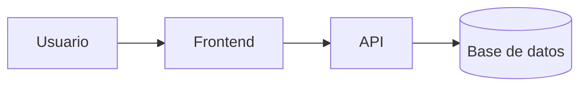

# SweetCake - Tienda Online de Repostería


Proyecto de práctica para aprender Markdown avanzado en GitHub.

## Descripción

SweetCake es una plataforma e-commerce interactiva dedicada a la venta y personalización de pasteles y postres artesanales. Permite a los clientes explorar nuestro catálogo dulce, realizar sus pedidos y calcular el costo de entrega a domicilio.

## Tabla de contenidos

- [Descripción](#descripción)
- [Instalación](#instalación)
- [Uso](#uso)
- [Estado de funcionalidades](#estado-de-funcionalidades)
- [Pendientes](#pendientes)
- [Arquitectura](#arquitectura)
- [Contribuidores](#contribuidores)

## Instalacion

```bash
git clone [https://github.com/kasandracruz-dev/laboratorio-readme.git](https://github.com/kasandracruz-dev/laboratorio-readme.git)
cd laboratorio-readme
npm instal
```

## Estado de funcionalidades
| Función  | Estado |
|----------|--------| 
|Catálogo  | Listo  |
|Carrito   | Listo  |
|Reportes  |En progreso|

## Pendientes

- [x] Diseñar la interfaz del catálogo de productos

- [x] Crear el flujo del carrito de compras

- [ ] Integrar pasarela de pago (MercadoPago / Yape)

- [ ] Sistema de seguimiento de delivery en tiempo real

## Arquitectura



## Contribuidores

Desarrollado por: Kasandra Cruz Jimenez
GitHub: @kasandracruz-dev


